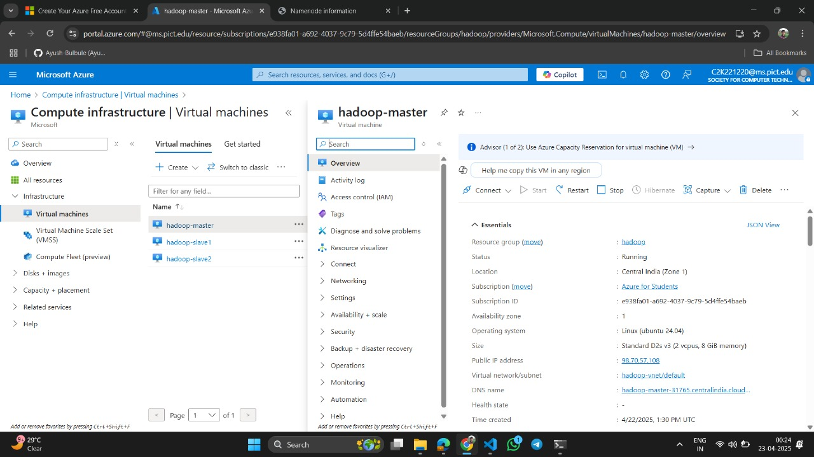
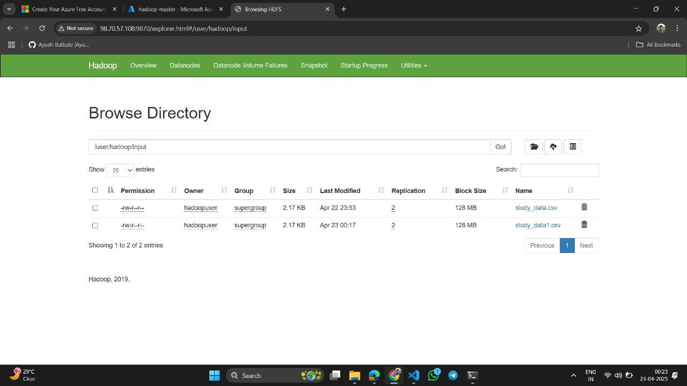
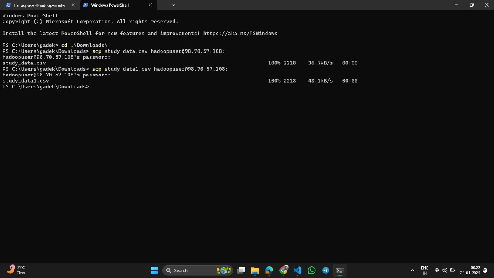
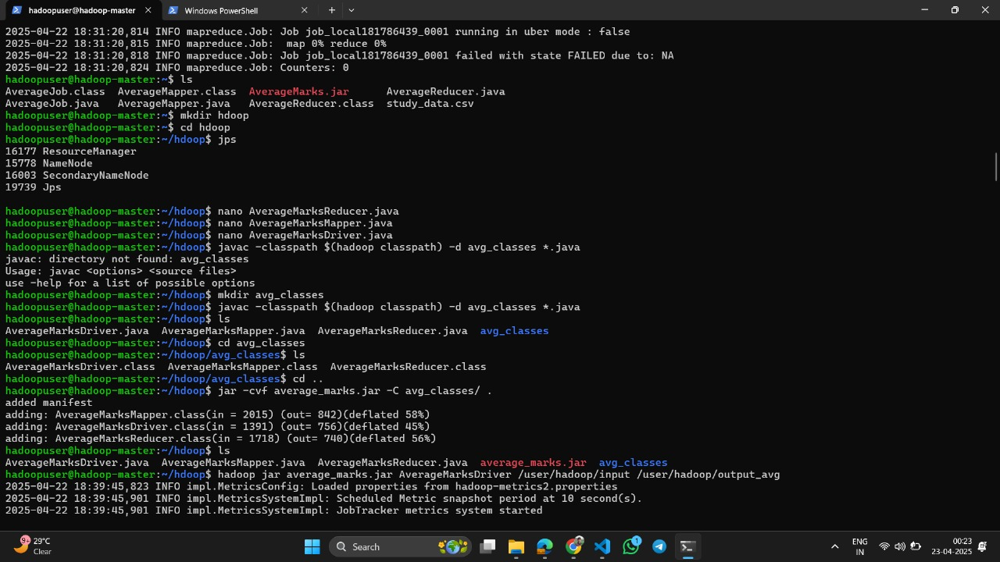
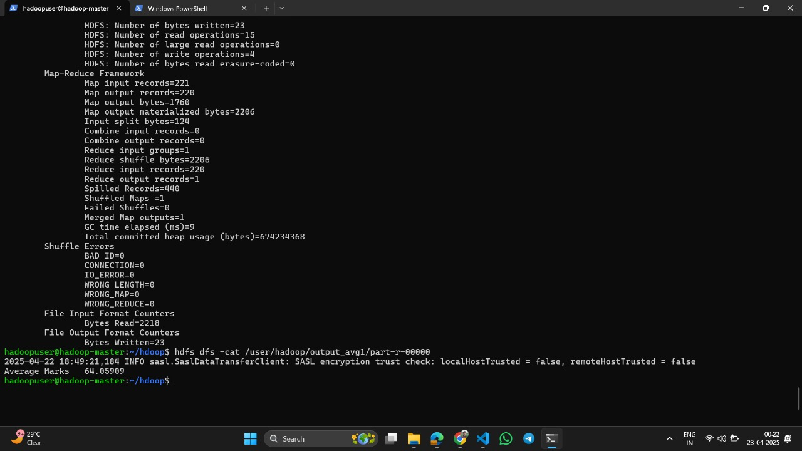

# 📊 Marks Data Analysis over Private Cloud (HDFS on Azure)

This project demonstrates a solution for analyzing large-scale marks data using **Hadoop HDFS**, **MapReduce**, and **custom private cloud infrastructure** deployed over a **Local Area Network (LAN)**. It is hosted on **Azure Virtual Machines**, enabling distributed storage, encryption, and statistical computation (average marks) with Hadoop ecosystem tools.

---

## 🚀 Project Overview

- 💾 **Store & process large marks datasets**
- 🔐 **Upload/download encrypted files**
- ☁️ **Hosted over a private cloud using Azure VMs**
- ⚙️ **Distributed using Hadoop HDFS and MapReduce**
- 📈 **Average marks calculation with custom Java code**

---

<p>
 

</p>


## 📡 System Architecture

- `1 Master Node` (NameNode, ResourceManager)
- `2 Data Nodes` (DataNode services)
- Hosted on `Azure Virtual Machines` in the same **Virtual Network**
- SSH enabled, passwordless login among nodes
- HDFS used for file segmentation and replication

---

## 🛠️ Technology Stack

| Component         | Technology Used           |
|------------------|---------------------------|
| Distributed FS   | Hadoop HDFS               |
| Processing       | Java MapReduce            |
| Encryption       | OpenSSL                   |
| Platform         | Azure Cloud (VMs)         |
| OS               | Ubuntu 20.04 LTS          |
| Scripts          | Bash                      |

---

## 🧰 System Requirements

- **Hardware:**
  - 1 Master + 2 DataNodes (each: 4GB RAM, 100GB HDD)
  - Stable LAN (Azure Virtual Network)

- **Software:**
  - Java JDK 8+
  - Hadoop 3.x
  - OpenSSL
  - SSH/SCP
---

## 📦 Java MapReduce Code – Average Marks Calculator

We use MapReduce to compute **average marks of students** from a file stored in HDFS.

### ✅ Input format (HDFS file):

Alice 85  
Bob 70  
John 100  

### ✅ Output:

Average Marks : 51.6


### 🧾 Files:
- `MarksMapper.java` – emits (student, marks) 
- `MarksReducer.java` – calculates average of student marks
- `AverageMarksDriver.java` – configures and runs the job

> 💡 Code available in the `/src` folder.


## ☁️ 1. Connect to Azure Virtual Machines
After deploying 3 Ubuntu VMs on Azure (Master, DataNode1, DataNode2):

On your local system (with .pem file or SSH key):

```bash
ssh username@<master_public_ip>
```
Repeat for datanodes:
```bash
ssh username@<datanode1_ip>
ssh username@<datanode2_ip>
```


## 🔧 2. Install Java & Hadoop on All Nodes
Java JDK:

```bash
sudo apt update
sudo apt install openjdk-8-jdk -y
java -version
```

Hadoop (repeat on each node):
```bash
wget https://downloads.apache.org/hadoop/common/hadoop-3.3.6/hadoop-3.3.6.tar.gz
tar -xzf hadoop-3.3.6.tar.gz
sudo mv hadoop-3.3.6 /usr/local/hadoop
```

Set environment variables (~/.bashrc):
```bash
export JAVA_HOME=/usr/lib/jvm/java-8-openjdk-amd64
export HADOOP_HOME=/usr/local/hadoop
export PATH=$PATH:$HADOOP_HOME/bin:$HADOOP_HOME/sbin
source ~/.bashrc
```

## 🔐 3. Enable SSH & Passwordless SSH (from Master to DataNodes)

On Master:
```bash
ssh-keygen -t rsa
ssh-copy-id user@datanode1_ip
ssh-copy-id user@datanode2_ip
```
Also, edit /etc/hosts on all 3 machines for hostname resolution.


## 🛠️ 4. Configure Hadoop Cluster (Master & DataNodes)

Edit the following config files on all nodes (from $HADOOP_HOME/etc/hadoop/):

core-site.xml:
```bash
<configuration>
  <property>
    <name>fs.defaultFS</name>
    <value>hdfs://master:9000</value>
  </property>
</configuration>
```

hdfs-site.xml:
```bash
<configuration>
  <property>
    <name>dfs.replication</name>
    <value>2</value>
  </property>
  <property>
    <name>dfs.namenode.name.dir</name>
    <value>file:///usr/local/hadoop/hdfs/namenode</value>
  </property>
  <property>
    <name>dfs.datanode.data.dir</name>
    <value>file:///usr/local/hadoop/hdfs/datanode</value>
  </property>
</configuration>
```

mapred-site.xml:
```bash
cp mapred-site.xml.template mapred-site.xml

<configuration>
  <property>
    <name>mapreduce.framework.name</name>
    <value>yarn</value>
  </property>
</configuration>
```

yarn-site.xml:
```bash
<configuration>
  <property>
    <name>yarn.resourcemanager.hostname</name>
    <value>master</value>
  </property>
</configuration>
```

## 🏁 5. Start Hadoop Cluster (on Master Node)

Format the Namenode (first time only):
```bash
hdfs namenode -format
```
Start HDFS:
```bash
start-dfs.sh
```
Start YARN:
```bash
start-yarn.sh
```
Verify:
```bash
jps     # should show NameNode, DataNode, ResourceManager, etc.
```

## 📤 6. Send Java Code and Create JAR

On your local machine:
```bash
scp AverageMarksMapper.java MarksReducer.java MarksDriver.java username@<master_ip>:/home/username/
```

On master:
```bash
javac -classpath $(hadoop classpath) -d avg_classes *.java
jar -cvf average_marks.jar -C avg_classes/ .
```

## 📁 7. Upload Input File to HDFS

Put into HDFS:
```bash
hdfs dfs -mkdir /input
hdfs dfs -put stud_data.csv /input/
```

<p>


</p>

## 🧮 8. Run MapReduce Job
```bash
hadoop jar average_marks.jar AverageMarksDriver /input /output
```



## 📂 9. Check Output
```bash
hdfs dfs -ls /output
hdfs dfs -cat /output/part-r-00000
```

